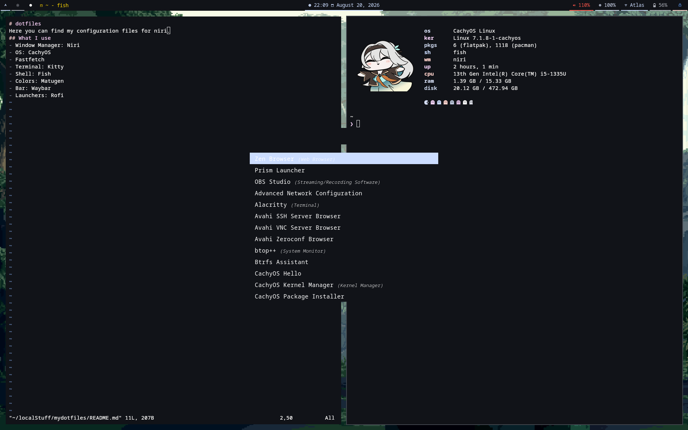

<h1 align="center"><code>~\mydotfiles</code></h1>


My config files for niri.

## What I use
- [fastfetch](https://github.com/fastfetch-cli/fastfetch)
- [fish](https://github.com/fish-shell/fish-shell)
- [kitty](https://github.com/kovidgoyal/kitty)
- [matugen](https://github.com/InioX/matugen)
- [niri](https://github.com/niri-wm/niri)
- [rofi](https://github.com/davatorium/rofi)
- [starship](https://github.com/starship/starship)
- [waybar](https://github.com/Alexays/Waybar)

## Setup Guide
Config files are in `.configfiles` and scripts are in `.localfiles`. Run the following commands to move them into their respective directories:
```
mkdir -p ~/.config ~/.local/bin
git clone https://github.com/AxolotylThatLovesDreaming/mydotfiles
cd mydotfiles
cp -a /.configfiles/ ~/.config && cp -a /.localfiles/ ~/.local
```

